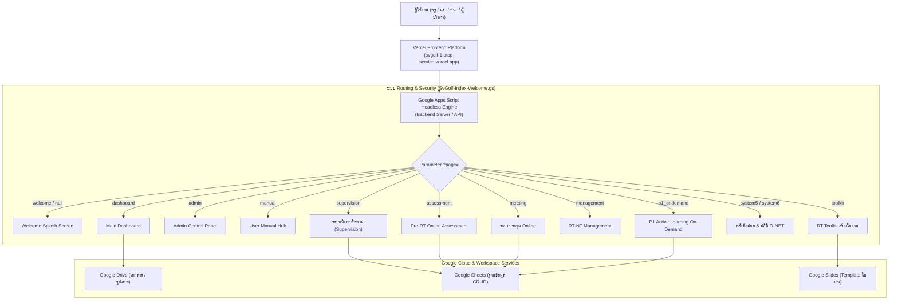

# 🌟 SV.GOLF One Stop Service Platform
> **ระบบศูนย์รวมบริการดิจิทัลทางการศึกษาและการนิเทศออนไลน์**  
> สำนักงานเขตพื้นที่การศึกษาประถมศึกษาน่าน เขต 1 (สพป.น่าน เขต 1)  
> **ผู้พัฒนา:** นายพุฒิพงษ์ วงศ์นันท์ (ศึกษานิเทศก์ สพป.น่าน เขต 1)

[](https://developers.google.com/apps-script)
[](https://v8.dev/)
[](https://getbootstrap.com/)
[](https://www.chartjs.org/)
[](https://sweetalert2.github.io/)
[](https://github.com/parallax/jsPDF)

---

## 📌 สารบัญ (Table of Contents)
1. [ภาพรวมระบบ (System Overview)](#-ภาพรวมระบบ-system-overview)
2. [สถาปัตยกรรมของระบบ (Architecture)](#-สถาปัตยกรรมของระบบ-architecture)
3. [ระบบย่อยทั้งหมด (Core Subsystems)](#-ระบบย่อยทั้งหมด-core-subsystems)
4. [โครงสร้างไดเรกทอรี (Directory Structure)](#-โครงสร้างไดเรกทอรี-directory-structure)
5. [การติดตั้งและนำไปใช้งาน (Deployment Guide)](#-การติดตั้งและนำไปใช้งาน-deployment-guide)
   - [การนำขึ้น Google Apps Script ด้วย Clasp](#วิธีที่-1-deploy-ผ่าน-google-clasp-cli-แนะนำ)
   - [การนำขึ้น Google Apps Script แบบ Manual](#วิธีที่-2-นำโค้ดไปวางใน-google-apps-script-editor)
   - [การเปิดใช้งาน Portal ผ่าน GitHub Pages](#การเปิดใช้งาน-portal-ผ่าน-github-pages)
6. [การตั้งค่าฐานข้อมูลและสิทธิ์ (Configuration)](#-การตั้งค่าฐานข้อมูลและสิทธิ์-configuration)
7. [เอกสารอ้างอิงและคู่มือ (Documentation)](#-เอกสารอ้างอิงและคู่มือ-documentation)

---

## 📖 ภาพรวมระบบ (System Overview)

**SV.GOLF One Stop Service** คือ แพลตฟอร์ม Web Application แบบรวมศูนย์ (One Stop Service Platform) ที่พัฒนาขึ้นบนเทคโนโลยี **Google Workspace & Google Apps Script (GAS)** ร่วมกับ Modern Web Technologies ออกแบบมาเพื่อเพิ่มประสิทธิภาพ ความสะดวกรวดเร็ว และความถูกต้องแม่นยำในการบริหารจัดการงานวิชาการ การนิเทศติดตาม และงานวัดและประเมินผลการศึกษาของ สพป.น่าน เขต 1

### จุดเด่นสำคัญ:
- 🚀 **Single Entry Point & Dynamic Routing:** เข้าถึงบริการทุกระบบได้จากหน้าเดียวผ่านพารามิเตอร์ `?page=...`
- 📊 **Real-time Analytics & Data Visualization:** แสดงผลสถิติและผลการประเมินด้วย Radar Chart, Bar Chart แบบเรียลไทม์
- 📄 **Official PDF Generator:** ระบบสร้างและส่งออกรายงานราชการมาตรฐาน พร้อมช่องลงนามและเว้นระยะขอบกระดาษ 15 มม.
- 🛡️ **Role-Based Access Control:** ควบคุมสิทธิ์การเข้าใช้งานตามบทบาท (นักเรียน, ครู, ผู้บริหารสถานศึกษา, ศึกษานิเทศก์, ผู้ดูแลระบบ)
- 🌐 **Headless Backend & Vercel Frontend:** แยกการทำงานอย่างชัดเจน โดยใช้ **Vercel** (`https://svgolf-1-stop-service.vercel.app`) เป็นหน้าบ้านหลักเพียงแห่งเดียว และใช้ Google Apps Script เป็นเซิร์ฟเวอร์หลังบ้านแบบ Headless ปราศจากลิงก์ Apps Script หลุดรอดสู่สายตาผู้ใช้

---

## 🏗️ สถาปัตยกรรมของระบบ (Architecture)



---

## 🧩 ระบบย่อยทั้งหมด (Core Subsystems)

| ลำดับ | ชื่อระบบ | คำอธิบาย | ไฟล์ Backend | ไฟล์ Template Frontend |
|---|---|---|---|---|
| **1** | **Main Dashboard & Admin** | หน้าหลักรวมบริการ สถิติผู้ใช้งาน และแผงควบคุมระบบของ Admin | `SvGolf-Index-Welcome.gs` | `html_welcome.html`, `html_dashboard.html`, `html_admin.html`, `html_closed.html`, `html_manual.html` |
| **2** | **Supervision & Classroom Obs** | ระบบนิเทศติดตามการเปิดภาคเรียน และการสังเกตชั้นเรียน พร้อมออกรายงาน PDF ทางการ | `SvGolf-Index-Welcome.gs` | `html_supervision.html`, `html_supervision_report.html`, `html_classroom_obs.html`, `html_classroom_obs_report.html` |
| **3** | **RT Toolkit** | เครื่องมือช่วยคุณครูสร้างใบงานแบบฝึกทักษะการอ่านภาษาไทยอัตโนมัติ | `NAN1_RT_Toolkit.gs` | `html_toolkit.html` |
| **4** | **Pre-RT Online Assessment** | ระบบจัดสอบและประเมินผลออนไลน์แยกตามบทบาท (นักเรียน, ครู, ผู้บริหาร, เขตพื้นที่) | `RT_Assessment_online.gs` | `html_assessment.html` |
| **5** | **RT-NT Management System** | ระบบบริหารจัดการและรายงานข้อมูลการสอบ RT และ NT ระดับเขตพื้นที่ | `RT_NT_Management.gs` | `html_management.html` |
| **6** | **Online Meeting System** | ระบบลงทะเบียน เช็คอิน เข้าร่วมประชุมออนไลน์ และดาวน์โหลดเอกสาร/วุฒิบัตร | `Online_Meeting.gs` | `html_meeting.html`, `html_meeting_admin.html`, `html_meeting_success.html` |
| **7** | **O-NET & Examination Bank** | ระบบคลังข้อสอบอัจฉริยะ และระบบรายงานคะแนนสอบย้อนหลังระดับโรงเรียน | `SvGolf-Index-Welcome.gs` | `html_system5.html`, `html_system6.html`, `html_onet_bank.html`, `html_onet_nanoy2.html`, `html_rt_nanoy2.html`, `html_nt_nanoy2.html` |
| **8** | **P.1 Active Learning On-Demand** | แพลตฟอร์มการพัฒนาสมรรถนะครู Active Learning ภาษาไทย ป.1 | `P1_OnDemand_Backend.gs` | `html_p1_ondemand.html` |

---

## 📁 โครงสร้างไดเรกทอรี (Directory Structure)

```text
SVGolf1StopService/
├── .github/                     # GitHub Actions / Workflows (ถ้ามี)
├── .gitignore                   # ตัวกรองไฟล์ขยะ, ไฟล์ OS และ Google Drive Links
├── .gitattributes               # ตั้งค่าการจัดรูปแบบ Text (LF) และ Encoding UTF-8
├── appsscript.json              # ไฟล์ Manifest ของ Google Apps Script
├── .clasp.json.example          # ตัวอย่างไฟล์ตั้งค่าสำหรับ Clasp CLI
├── README.md                    # คู่มือภาพรวมโครงการ (ไฟล์นี้)
├── SUMMARY_REORGANIZATION.md    # รายงานสรุปการจัดระเบียบโครงสร้างระบบและคู่มือ Git
├── index.html                   # หน้าเว็บ Portal หลักสำหรับ GitHub Pages (Iframe Wrapper)
│
├── src/                         # ซอร์สโค้ดของระบบทั้งหมด (สำหรับ Google Apps Script)
│   ├── appsscript.json          # Manifest สำหรับ Clasp rootDir
│   ├── SvGolf-Index-Welcome.gs  # Backend หลัก: Router, Admin, Dashboard, Supervision
│   ├── NAN1_RT_Toolkit.gs       # Backend: RT Toolkit
│   ├── RT_Assessment_online.gs  # Backend: Pre-RT Online Assessment
│   ├── RT_NT_Management.gs      # Backend: RT-NT Management
│   ├── Online_Meeting.gs        # Backend: ระบบประชุมออนไลน์
│   ├── P1_OnDemand_Backend.gs   # Backend: P.1 Active Learning On-Demand
│   └── html_*.html              # Templates Frontend (22 ไฟล์)
│
├── docs/                        # เอกสารโครงการและคู่มือการใช้งาน
│   ├── USER_MANUAL.md           # คู่มือการใช้งานสำหรับผู้ใช้ทั่วไป
│   ├── PROJECT_SUMMARY.md       # สรุปสาระสำคัญของระบบเดิม
│   └── references/              # เอกสารอ้างอิงและมาตรฐานราชการ
│       ├── 2.มาตรฐานตำแหน่งมาตรฐานวิทยฐานะ(ว 19-2567).pdf
│       └── 3.กรอบงานกลุ่มนิเทศ.pdf
│
├── assets/                      # ไฟล์สื่อ ทรัพยากร และภาพประกอบ
│   ├── images/
│   │   └── INDEX.png            # ภาพ Splash screen / Index Banner
│   └── evidence/                # ภาพหลักฐานและการจัดประชุม
│
├── modules/                     # โครงการย่อยและเอกสารแนบ
│   └── p1_ondemand/             # ทรัพยากรเพิ่มเติมโครงการ Active Learning ป.1
│
└── archive/                     # ไฟล์สำรอง ไฟล์ทดสอบ และ Dump ในอดีต (ไม่ถูก Push ขึ้น Git)
    ├── legacy_scripts/          # สคริปต์รุ่นเก่า / ไฟล์ซ้ำซ้อน
    └── temp_dumps/              # ไฟล์ Base64 และไฟล์ชั่วคราว
```

---

## 🚀 การติดตั้งและนำไปใช้งาน (Deployment Guide)

### วิธีที่ 1: Deploy ผ่าน Google Clasp CLI (แนะนำ)

1. ติดตั้ง `@google/clasp` บนเครื่องคอมพิวเตอร์:
   ```bash
   npm install -g @google/clasp
   ```
2. ล็อกอินเข้าสู่ Google Account:
   ```bash
   clasp login
   ```
3. คัดลอกไฟล์ `.clasp.json.example` เป็น `.clasp.json`:
   ```bash
   cp .clasp.json.example .clasp.json
   ```
4. ใส่ `scriptId` ของ Google Apps Script โครงการของคุณลงใน `.clasp.json`
5. ส่งโค้ดขึ้น Apps Script:
   ```bash
   clasp push
   ```

---

### วิธีที่ 2: นำโค้ดไปวางใน Google Apps Script Editor

1. เข้าไปที่ [Google Apps Script Dashboard](https://script.google.com/) แล้วสร้างโปรเจกต์ใหม่
2. สร้างไฟล์สคริปต์ (`.gs`) ใน Apps Script ตามรายชื่อไฟล์ในโฟลเดอร์ `src/*.gs` แล้วคัดลอกโค้ดไปวาง
3. สร้างไฟล์ HTML (`.html`) ใน Apps Script ตามรายชื่อไฟล์ `src/html_*.html` แล้วคัดลอกโค้ดไปวาง
4. กดบันทึก (Save) ทั้งหมด
5. คลิก **การทำให้ใช้งานได้ (Deploy)** > **การทำให้ใช้งานได้รายการใหม่ (New Deployment)**
   - ชนิด: **เว็บแอป (Web App)**
   - ดำเนินการในฐานะ: **ฉัน (User deploying)**
   - ผู้มีสิทธิ์เข้าถึง: **ทุกคน (Anyone)**
6. คัดลอก Web App URL ที่ได้ (ลงท้ายด้วย `/exec`)

---

### การเปิดใช้งาน Frontend ผ่าน Vercel (Official)
ระบบใช้ **Vercel** เป็นหน้าบ้านหลักที่: [**https://svgolf-1-stop-service.vercel.app/**](https://svgolf-1-stop-service.vercel.app/)
1. โค้ดหน้าบ้าน `index.html` จะทำหน้าที่รับค่า `window.location.search` (เช่น `?page=dashboard`, `?page=toolkit`) แล้วส่งต่อไปยัง Google Apps Script Headless Backend ในพื้นหลังโดยอัตโนมัติ
2. โค้ดหลังบ้านจะสร้างลิงก์ทั้งหมดให้ชี้กลับมาที่ `https://svgolf-1-stop-service.vercel.app/?page=...` เสมอ
3. ผู้ใช้งานจะเห็นเฉพาะโดเมน `svgolf-1-stop-service.vercel.app` ตลอดการใช้งาน โดยไม่มี URL ของ `script.google.com` แสดงให้เห็นเลย

---

## ⚙️ การตั้งค่าฐานข้อมูลและสิทธิ์ (Configuration)

### 1. Spreadsheet IDs หลักของระบบ
- **ฐานข้อมูลระบบนิเทศและสารสนเทศกลาง:** `11yGuC2wfJOM1Ibqfb0wCo9J9_mNlJjbZKq-YtVpDGl0`
- **ฐานข้อมูล RT NAN1 Toolkit:** `12nuP1dNlCHa-Lr0IWLpLHuRCtZNEFhfWIKOInIiGGY0`
- **ฐานข้อมูล Pre-RT Online Assessment:** `1HsXF1_m_EUMQ8SsnFYSHTZrU_Ztdx2zWXcnyG-SYnOk`
- **ฐานข้อมูลระบบประชุม Online:** `1i6O1xa-HXwiK4OKY5atEPd1eA4cM5td7pxpOr0QjxjI`

### 2. รหัสผ่านและความปลอดภัย
- **รหัสผ่านผู้ดูแลระบบ (Admin Password):** กำหนดไว้ที่ตัวแปร `ADMIN_PASSWORD` ใน `SvGolf-Index-Welcome.gs`
- **รหัส PIN ระบบนิเทศติดตาม:** `2569`

---

## 📚 เอกสารอ้างอิงและคู่มือ (Documentation)

- 📘 [คู่มือการใช้งานระบบฉบับสมบูรณ์ (USER_MANUAL.md)](docs/USER_MANUAL.md)
- 📑 [สรุปโครงการและบันทึกทางเทคนิค (PROJECT_SUMMARY.md)](docs/PROJECT_SUMMARY.md)
- 📝 [รายงานสรุปการจัดโครงสร้างระบบใหม่ (SUMMARY_REORGANIZATION.md)](SUMMARY_REORGANIZATION.md)

---

## 👨‍💻 ผู้พัฒนาและลิขสิทธิ์ (Developer & Copyright)

- **ผู้ออกแบบและพัฒนา:** นายพุฒิพงษ์ วงศ์นันท์ (ศึกษานิเทศก์ สพป.น่าน เขต 1)
- **หน่วยงาน:** กลุ่มนิเทศ ติดตาม และประเมินผลการจัดการศึกษา สำนักงานเขตพื้นที่การศึกษาประถมศึกษาน่าน เขต 1
- **สงวนลิขสิทธิ์ พ.ศ. 2568 - 2569**
